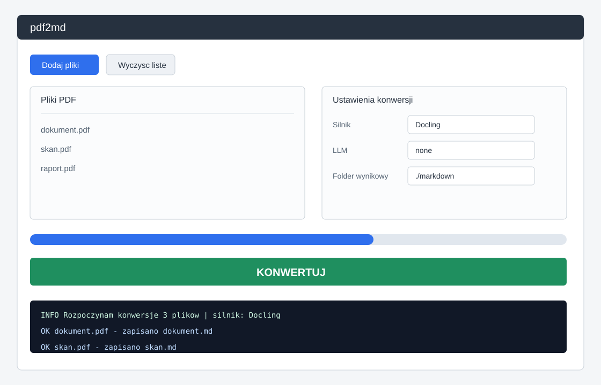

# pdf2md

[](https://github.com/chodzkos/pdf2md/actions/workflows/ci.yml)
[](LICENSE)
[](pyproject.toml)

pdf2md konwertuje pliki PDF do Markdown przez kilka wymiennych silnikow: szybkie ekstraktory tekstu, OCR i parsery dokumentow z tabelami. Aplikacja ma CLI, GUI oraz opcjonalny post-processing LLM dla czyszczenia i strukturyzowania wyniku.

## ✨ Funkcje

- Konwersja pojedynczych PDF-ow i batchy do Markdown.
- GUI w PySide6 oraz CLI oparte o Click.
- Silniki: PyMuPDF4LLM, Marker, Docling (rdzeniowe) oraz MinerU, Surya, PaddleOCR-VL (opcjonalne, w tym VLM-OCR dla skanów).
- OCR dla skanow, dokumentow wielokolumnowych, tabel i materialow naukowych.
- Opcjonalne LLM: Ollama, Anthropic Claude, OpenAI i Google Gemini.
- Eksport do Markdown i EPUB przez Pandoc.
- `pdf2md doctor` do diagnozy Tesseracta, Pandoca, Ollamy, PyTorch/CUDA i zainstalowanych silnikow.
- Wspolny `config.toml` dla CLI i GUI.

## 🔧 Silniki konwersji

| Silnik | Typ dokumentu | OCR | Czym doinstalować |
|---|---|---:|---|
| PyMuPDF4LLM | Natywne PDF-y z warstwa tekstowa | Nie | `uv pip install pymupdf4llm` |
| Marker | Skanowane i mieszane PDF-y, OCR, layout | Tak | `uv pip install marker-pdf` |
| Docling | Tabele, dokumenty biznesowe, RAG | Tak | `uv pip install docling` |
| MinerU | Artykuly naukowe, CJK, wielokolumnowe uklady | Tak | `uv tool install mineru --with mineru[all]` |
| Surya | Layout + OCR + reading order (GPU, in-process) | Tak | `uv pip install surya-ocr` |
| PaddleOCR-VL | Wielojęzyczny VLM-OCR (serwer vLLM, izolowany) | Tak | serwer vLLM — zob. [INSTALL.md](INSTALL.md) |
| olmOCR | VLM 7B do skanów — **zaparkowany** (anglocentryczny) | Tak | external-server — zob. [ENGINES.md](ENGINES.md) |

Pakiet `pdf2md` jest orkiestratorem MIT. Silniki, zwlaszcza copyleft albo bardzo ciezkie, instaluje u siebie uzytkownik; `pdf2md doctor` pokazuje, czego brakuje.

## 📦 Instalacja

### Wymagania wstępne (systemowe)

- Python 3.11 lub 3.12 (3.13+ nie jest obsługiwany — ekosystem ML nie nadąża).
- `uv` do instalacji i uruchamiania projektu.
- Tesseract OCR dla workflow OCR.
- Poppler, gdy silnik lub narzedzie pomocnicze wymaga narzedzi PDF z systemu.
- Pandoc, jesli eksportujesz do EPUB.
- Opcjonalnie Ollama dla lokalnego LLM.
- Opcjonalnie CUDA/PyTorch dla silnikow GPU; `pdf2md doctor` sprawdza tez realna uzywalnosc CUDA.

### Instalacja aplikacji

```bash
uv tool install pdf2md
pdf2md doctor
```

Jesli pracujesz w aktywnym virtualenv zamiast `uv tool`:

```bash
uv pip install pdf2md
```

Do pracy z repozytorium:

```bash
git clone https://github.com/chodzkos/pdf2md
cd pdf2md
uv sync
```

### Instalacja silników (opcjonalnie)

```bash
uv pip install pymupdf4llm
uv pip install marker-pdf
uv pip install docling
```

LLM:

```bash
uv pip install anthropic
uv pip install openai
uv pip install google-genai
```

Jesli instalujesz `pdf2md` jako izolowane narzedzie `uv tool`, mozesz od razu dolaczyc zaleznosci do tego samego srodowiska:

```bash
uv tool install pdf2md --with pymupdf4llm --with docling
```

MinerU:

```bash
uv tool install mineru --with mineru[all]
mineru --help
```

## 🚀 Użycie

### GUI



Uruchom:

```bash
pdf2md-gui
```

Mozesz tez przekazac pliki startowe:

```bash
pdf2md-gui dokument.pdf skan.pdf
```

W GUI dodajesz pliki PDF, wybierasz silnik, opcjonalnie dostawce LLM, folder wynikowy i uruchamiasz konwersje. Panel logow pokazuje postep i bledy, a zakladka podgladu pokazuje ostatnio utworzony Markdown.

### CLI

Lista silnikow:

```bash
$ pdf2md list-engines
Silniki konwersji
PyMuPDF4LLM  Dostępny/Niezainstalowany  Core
Marker       Dostępny/Niezainstalowany  Core
Docling      Dostępny/Niezainstalowany  Core
MinerU       Dostępny/Niezainstalowany  Opc.
Surya        Dostępny/Niezainstalowany  Opc.
PaddleOCR-VL Dostępny/Niezainstalowany  Opc.
```

Konwersja pojedynczego pliku:

```bash
$ pdf2md convert dokument.pdf --engine pymupdf4llm
Raport końcowy
Pliki: 1/1
Silnik: PyMuPDF4LLM
```

Batch do katalogu:

```bash
pdf2md convert "pdfy/*.pdf" --engine docling --output-dir ./markdown
```

Plan bez konwersji:

```bash
pdf2md convert dokument.pdf --dry-run
```

Konwersja z LLM:

```bash
pdf2md convert dokument.pdf --engine marker --llm ollama --llm-mode by_heading
```

Diagnoza srodowiska:

```bash
pdf2md doctor
```

Konfiguracja:

```bash
pdf2md config show
pdf2md config set conversion.default_engine docling
pdf2md config set docling.docling_device auto
pdf2md config edit
```

## ⚙️ Konfiguracja

Zrodlem prawdy jest:

```text
~/.config/pdf2md/config.toml
```

Plik `.env` jest traktowany jako override deweloperski i moze nadpisac wartosci lokalnie. Nie jest docelowym miejscem konfiguracji produkcyjnej.

Najwazniejsze ustawienia:

| Klucz | Znaczenie |
|---|---|
| `conversion.default_engine` | Domyslny silnik: `pymupdf4llm`, `marker`, `docling`, `mineru`, `surya` |
| `conversion.default_output_dir` | Domyslny katalog wynikowy |
| `conversion.default_language` | Jezyk OCR, np. `pol+eng` |
| `marker.marker_device` | `auto`, `cpu` albo `cuda` |
| `marker.marker_workers` | Liczba workerow Markera |
| `marker.marker_max_pages` | Limit stron dla Markera, `0` oznacza brak limitu |
| `marker.marker_recognition_batch_size` | Rozmiar batcha GPU surya (0 = auto) |
| `docling.docling_device` | `auto`, `cpu` albo `cuda`; `auto` uzywa smoke testu CUDA |
| `mineru.mineru_backend` | `pipeline` (domyslny) albo `vlm` (max jakosc, wymaga vLLM) |
| `llm.provider` | `none`, `ollama`, `claude`, `openai`, `gemini` |
| `llm.mode` | `none`, `whole_document`, `by_page`, `by_chunk`, `by_heading` |

Zmienne i klucze LLM:

- `ANTHROPIC_API_KEY`, `OPENAI_API_KEY`, `GEMINI_API_KEY`
- `ANTHROPIC_MODEL`, `OPENAI_MODEL`, `GEMINI_MODEL`, `OLLAMA_MODEL`
- `OLLAMA_URL`

Domyslny lokalny model Ollama to `qwen3:14b`.

## 🤝 Współtworzenie

Plan rozwoju jest w [docs/ROADMAP.md](docs/ROADMAP.md). Szczegóły użycia w [docs/USAGE.md](docs/USAGE.md), pełna dokumentacja konfiguracji w [docs/CONFIGURATION.md](docs/CONFIGURATION.md).

Przed PR-em uruchom:

```bash
uv run ruff check .
uv run ruff format --check .
uv run mypy src/
uv run pytest --cov=pdf2md
```

Testy integracyjne i heavy uruchamiaj swiadomie, z odpowiednimi zaleznosciami i zasobami.

## License

MIT © 2025 Marcin
